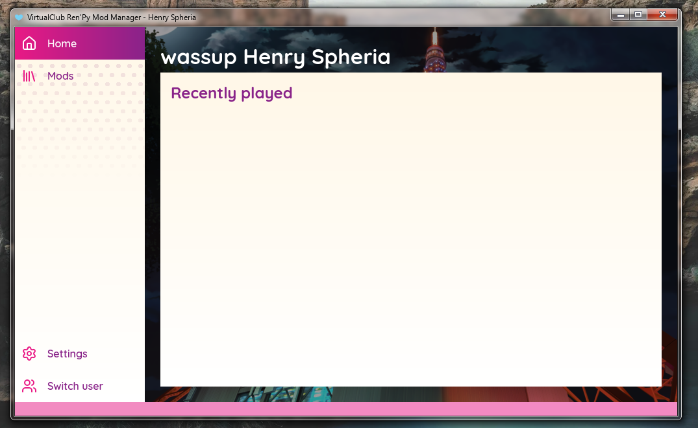

looks smth like this atm

(dont mind the title bar pls thx)

## Notice
This is a completely independent project and is not affiliated with any parties referenced throughout the program's interface.

## How Does This Work
long answer, magic

short answer, the "virtual filesystem" technology allows the launcher to construct a fake folder that replicates the traditional setup of a Ren'Py mod installation without actually consuming more disk spaces from making a copy of both the base game and the mod. meaning you get the benefit of disk space efficiency AND isolated save content. 

## Dependencies
`qt6`, `pybind11`, `fuse3` (winfsp on windows)
